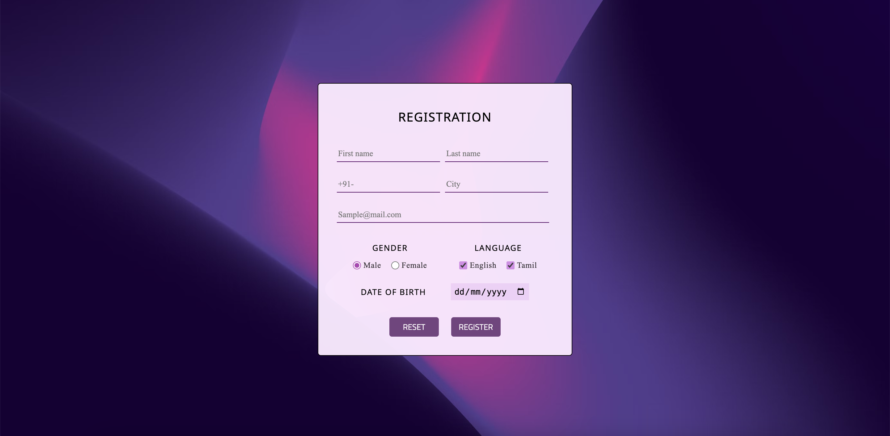

## Registration Form in React

- This is a simple registration form built with React.This project serves as a basic example of how to create a form in a React application.

## Screenshot of UI

## Live demo

- <a href="https://registration-form-reactjs-xo.vercel.app/" target="blank"> Live preview Of form</a>

## Features

- Registration form contain various fields for user name , email , phone etc..
- This form build with usestate hooks . so the data entered by the user will console in log.
- We can also set the API to this form directly.

## Technologies Used

- React js
- Css
- Html

## Development tools

- visual studio code

## Contributing

- If you'd like to contribute to this project,please follow these steps:

1. Fork the repository.
2. Create a new branch for your feature or bug fix.
3. Make your changes and commit them.
4. Push your changes to your fork.
5. Submit a pull request to this repository.

## Contact

- Name : Shanmuagraj sekar
- Mail : shanmugaraj2003@gmail.com

##

- Happy coding
